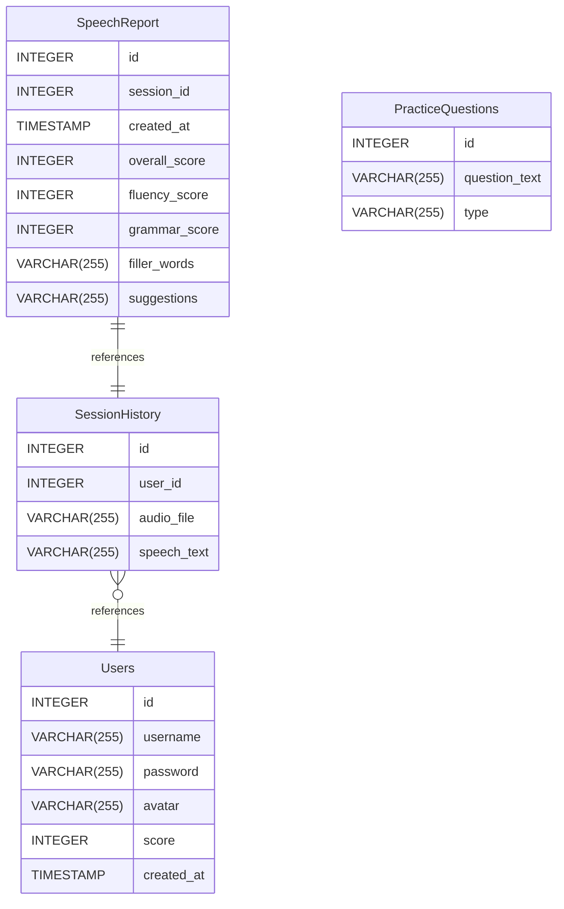

# BE Project documentation
## Summary

- [Introduction](#introduction)
- [Database Type](#database-type)
- [Table Structure](#table-structure)
	- [Users](#users)
	- [SessionHistory](#sessionhistory)
	- [SpeechReport](#speechreport)
	- [PracticeQuestions](#practicequestions)
- [Relationships](#relationships)
- [Database Diagram](#database-diagram)

## Introduction

## Database type

- **Database system:** PostgreSQL
## Table structure

### Users

| Name        | Type          | Settings                      | References                    | Note                           |
|-------------|---------------|-------------------------------|-------------------------------|--------------------------------|
| **id** | INTEGER | 🔑 PK, not null, unique, autoincrement |  | |
| **username** | VARCHAR(255) | not null |  | |
| **password** | VARCHAR(255) | not null |  | |
| **avatar** | VARCHAR(255) | null |  | |
| **score** | INTEGER | not null, default: 0 |  |This field will store the overall fluency score of the user. |
| **created_at** | TIMESTAMP | not null |  | | 

### SessionHistory

| Name        | Type          | Settings                      | References                    | Note                           |
|-------------|---------------|-------------------------------|-------------------------------|--------------------------------|
| **id** | INTEGER | 🔑 PK, not null, unique, autoincrement |  | |
| **user_id** | INTEGER | not null | List of Users History | |
| **audio_file** | VARCHAR(255) | not null |  | |
| **speech_text** | VARCHAR(255) | not null |  | | 

### SpeechReport

| Name        | Type          | Settings                      | References                    | Note                           |
|-------------|---------------|-------------------------------|-------------------------------|--------------------------------|
| **id** | INTEGER | 🔑 PK, not null, unique, autoincrement |  | |
| **session_id** | INTEGER | not null | Session Detail Report | |
| **created_at** | TIMESTAMP | not null |  | |
| **overall_score** | INTEGER | not null |  | |
| **fluency_score** | INTEGER | not null |  | |
| **grammar_score** | INTEGER | not null |  | |
| **filler_words** | VARCHAR(255) | not null |  |this is store the list of filler words  |
| **suggestions** | VARCHAR(255) | null |  | | 

### PracticeQuestions

| Name        | Type          | Settings                      | References                    | Note                           |
|-------------|---------------|-------------------------------|-------------------------------|--------------------------------|
| **id** | INTEGER | 🔑 PK, not null, unique, autoincrement |  | |
| **question_text** | VARCHAR(255) | not null |  | |
| **type** | VARCHAR(255) | not null |  |this field store the question topic like interview,presentation questions based  | 

## Relationships

- **SessionHistory to Users**: many_to_one
- **SpeechReport to SessionHistory**: one_to_one

## Database Diagram

